# 📚 Agentic Notes — a self-correcting multi-agent study engine

[](https://github.com/Kodishalathrilok/agentic-notes/actions/workflows/ci.yml)

**Live demo:** [huggingface.co/spaces/Thrilokkk/agentic-notes](https://huggingface.co/spaces/Thrilokkk/agentic-notes)

Feed it anything — pasted text, a PDF, a lecture recording, a photo of notes, an article URL, or a YouTube video — and a pipeline of cooperating AI agents turns it into **cited, verified study notes**, then quizzes you on them.

What makes it more than an "AI wrapper":

- **The pipeline checks its own work.** A critique agent judges the draft against the passages the writer was given, flags unsupported claims and missing topics, triggers corrective re-retrieval for the missing topics, and revises (up to 2 rounds) — a revision replaces the kept version only if it scores strictly higher.
- **Claims are checked against their sources.** Notes cite retrieved passages inline (`[3]`). A deterministic check drops any citation that doesn't point at a passage the model was shown (or, for PDFs, at a passage with a valid page), and a per-claim grounding pass then asks a helper model whether each claim line is actually supported by the passage it cites — unsupported lines are removed, over-reaching ones tightened.
- **Long documents are covered end to end.** Sources over 12,000 characters are split into coverage windows that partition the document — every chunk belongs to exactly one window and every window is written — and sources over 60,000 characters also get a full-document digest scan before planning. If a window fails, the notes say so with an "Incomplete coverage" banner naming the missing pages instead of passing as complete.
- **It's engineered, not vibe-coded:** 250+ backend tests, CI that gates deploys on green tests, SSRF-guarded URL fetching, request size limits, per-user rate limiting, and an LLM-judge eval harness that scores faithfulness and coverage.

## How it works

```mermaid
flowchart LR
    A[Source\ntext · PDF · audio · image · URL · YouTube] --> B[Gatekeeper\nacademic check + doc type]
    B --> C[Hybrid index\nBM25 + embeddings, rank fusion]
    C --> D[Digest scan\nwhole document, large sources only]
    D --> E[Planner\noutline + checklist]
    E --> F[Writer\nsingle pass or coverage windows]
    F --> G[Critique\nclaims vs. writer context]
    G -->|needs revision| H[Corrective re-retrieval\n+ Revise]
    H --> G
    G -->|approved or 2 rounds| I[Citation validation\ndeterministic]
    I --> J[Grounding check\nper claim, helper model]
    J --> K[Title]
    K --> L[Notes]
    L -.->|on demand| M[Quiz · Flashcards · Tutor chat]
```



1. **Gatekeeper** rejects non-study material and classifies the document type (explanatory, question bank, exam, mixed…); task-shaped documents get a writer rule that forbids turning a task into a statement of fact.
2. **Index**: the source is chunked (page-bounded for PDFs) and indexed for hybrid retrieval.
3. **Digest** (sources over 60,000 characters): a helper model reads the whole document in 25,000-character segments and builds a topic inventory the planner must cover.
4. **Planner** produces an outline and a checklist of must-cover points.
5. **Writer**: sources up to 12,000 characters are written in one streamed pass from a length-scaled retrieval (the whole source when it fits). Larger sources are split into contiguous coverage windows — at most 12 by default, each targeted at the larger of 6,000 characters and one-twelfth of the source, and capped so a window plus its supplements fits the writer's 40,000-character context (past that cap more windows are added; nothing is truncated). Each window is written from its own chunks plus a few retrieved passages from elsewhere, two at a time, and streamed to the UI in document order.
6. **Critique → revise** loop (max 2 rounds), then **citation validation** and the **grounding check**, then an auto-generated **title**.

Quiz and flashcards are not part of the notes run: the UI generates them on demand through `/api/quiz` and `/api/flashcards`. Every stage of the notes run streams to the UI in real time over SSE, so you watch the agents plan, write, critique, and revise live.

### Retrieval

The source is chunked (~700-character passages with overlap, cut on word boundaries, and kept within a single page for PDFs) and indexed two ways — **BM25** (lexical) and **semantic embeddings** (Gemini) — and results are merged with reciprocal rank fusion. If embeddings are unavailable (no key, or an API failure) retrieval falls back to BM25 only. There is no reranker after fusion yet. On the single-pass path the writer gets the passages most relevant to the plan; on the windowed path retrieval only adds supplementary evidence — which passages get written about is decided by the window partition, not by ranking. A retrieval benchmark (`backend/eval/`) measures hit-rate against a labeled dataset.

### Reliability details that took real work

- **Structured outputs for quizzes and flashcards.** Both are requested as JSON, validated (four options A–D and a valid answer letter per question; non-empty front and back per card) and rendered to the UI format deterministically, with a plain-text prompt as fallback if the JSON is unusable. An answer-key verifier (`verify_quiz`) that re-checks each marked answer against the notes exists, but it only runs on the in-pipeline path (`include_quiz=true`, used by the eval harness) — the on-demand `/api/quiz` the UI calls does not run it.
- **No tail-loss on long notes.** Agents that read the notes without rewriting them (critique, quiz, flashcards, chat) get an even sample across the whole notes, anchored to the end, instead of the first N characters. The in-pipeline revision refuses to run on notes over 30,000 characters rather than revising a truncated copy. Known limits: the standalone rewrite and edit-selection endpoints still cut their input at 30,000 characters, and the critique sees at most 12,000 characters of the writer's context (the reviser 40,000), so on long documents faithfulness is judged against the start of that context.
- **A cut-off stream is never passed off as complete.** If a provider stream fails part-way, or stops at the token cap, the model layer raises `IncompleteStreamError` instead of returning quietly. A cut-off coverage window is recorded as a failed window (and the notes get the "Incomplete coverage" banner), a cut-off single-pass draft is kept but marked incomplete, a cut-off revision is discarded in favour of the previous notes, and the tutor chat appends a "cut off" notice.
- **Blocking calls stay off the event loop.** The server runs one uvicorn worker that serves every SSE stream, so remote Supabase token verification, YouTube transcript fetches and PDF/DOCX/Markdown/CSV exports run in a thread pool. Measured `/api/health` latency while a 1-second blocking call is in flight: 1.01 s before, 0.006 s after.
- **Graceful model routing.** NVIDIA NIM (Nemotron) and Gemini Flash with automatic failover, mechanical sub-tasks routed to cheaper models to preserve free-tier quota, and a local Ollama fallback for fully offline use. Gemini ids are pinned for speed and self-heal to Google's moving alias if a version is retired, so neither a dead id nor an overloaded brand-new one can stall the pipeline.

## Features

- **Inputs:** paste text · PDF · image (OCR) · audio (transcription) · article URL · YouTube transcript
- **Outputs:** cited notes · interactive multiple-choice quiz and spaced-repetition flashcards (generated on demand) · PDF / Markdown / DOCX / CSV export
- **Study tools:** tutor chat grounded in your notes · select-and-edit any passage with an instruction · one-click rewrite (shorter / longer)
- **Controls:** study mode (exam, summary, deep-dive…), tone, length, format, model picker
- **Accounts:** Supabase auth (email + Google), cloud session history, shareable public note links — with a local-only mode when auth isn't configured

## Security & operations

- SSRF-protected URL fetching (private/internal addresses blocked, redirects re-validated per hop, download size capped)
- Request size limits on every endpoint; chunked uploads with hard caps (PDF 20 MB, audio 25 MB, image 10 MB)
- Per-user rate limiting (short sliding windows plus daily caps on the token-spending endpoints) with Supabase JWT verification
- A production start with authentication switched off refuses to boot (`verify_auth_config`) unless `ALLOW_ANONYMOUS=true` is set explicitly
- Bounded worker pool + concurrency gate so heavy generations can't starve the server; blocking work runs off the event loop
- CI on every push and pull request to `main`: backend tests and the frontend tests + build; a push to `main` deploys to Hugging Face Spaces only after both pass

## Tech stack

| Layer          | Tech                                                                       |
| -------------- | -------------------------------------------------------------------------- |
| Backend        | Python · FastAPI · SSE streaming                                           |
| Frontend       | React · Vite · Tailwind CSS                                                |
| Models         | NVIDIA NIM (Nemotron) · Gemini Flash · Ollama (local fallback)             |
| Retrieval      | BM25 (rank-bm25) + Gemini embeddings · rank fusion · BM25-only fallback    |
| Auth & storage | Supabase (JWT verification server-side, RLS-scoped sessions)               |
| Docs           | pypdf · reportlab · python-docx · Gemini audio + vision                    |
| CI/CD          | GitHub Actions → Hugging Face Spaces (Docker)                              |

## Run it locally

Use a virtual environment. The pinned `fastapi`/`starlette` versions conflict
with what other common packages (gradio, streamlit) require, so a shared global
install will break one side or the other.

```bash
# 1. Backend
cd backend
cp .env.example .env          # add NVIDIA_API_KEY (build.nvidia.com) and/or GEMINI_API_KEY
python -m venv .venv
source .venv/bin/activate     # Windows: .\.venv\Scripts\Activate.ps1
pip install -r requirements.txt -r requirements-dev.txt
python -m uvicorn main:app --reload   # http://127.0.0.1:8000

# 2. Frontend (new terminal)
cd frontend
npm install
npm run dev                   # http://localhost:5173
```

Run the backend from the `backend/` directory, or launch it with an absolute
path — `main.py` and friends resolve `.env` relative to their own location, so
the keys load either way, but `main:app` still has to be importable.

`python main.py` also works and binds `0.0.0.0:8000` instead of loopback.

Works with either provider key on its own. Setting both gives you NVIDIA as
primary with Gemini as automatic failover:

| Variable                                                         | Purpose                                          |
| ---------------------------------------------------------------- | ------------------------------------------------ |
| `NVIDIA_API_KEY` / `NVIDIA_MODEL`                                | Primary writing model (exact catalog id required) |
| `HELPER_NVIDIA_MODEL` / `HELPER_GEMINI_MODEL`                    | Cheaper model for the mechanical steps (unset NVIDIA helper = main model) |
| `GEMINI_API_KEY`                                                 | Failover, semantic embeddings, image OCR, audio transcription |
| `OLLAMA_URL` / `OLLAMA_MODEL`                                    | Local offline fallback                            |
| `SUPABASE_URL` / `SUPABASE_ANON_KEY` or `SUPABASE_JWT_SECRET`    | Server-side token verification (required for a production start) |
| `ALLOW_ANONYMOUS`                                                | Explicitly allow a production start with auth off |
| `VITE_SUPABASE_URL` / `VITE_SUPABASE_ANON_KEY`                   | Auth + cloud history (frontend `.env`)        |
| `DAILY_GENERATIONS`, `DAILY_EXTRACTS`, `DAILY_REGENS`, `DAILY_CHATS` | Per-account daily caps                        |
| `MAX_TEXT_CHARS`, `WORKER_THREADS`, `MAX_CONCURRENT_GENERATIONS` | Server tuning                                 |

## Tests & evaluation

```bash
cd backend
pip install -r requirements-dev.txt
pytest        # 250+ tests: pipeline, long-document coverage, parsers, retrieval, security, stream integrity, event-loop blocking, truncation-safety
```

The eval harness (`backend/eval/`) runs the full pipeline on fixture documents and uses an LLM judge to score **faithfulness** (are claims supported by the source?), **coverage** (are key topics present?), and **quiz answer accuracy** — plus a retrieval hit-rate benchmark. Run with `python -m eval.run_eval`.

## Project structure

```
agentic-notes/
├── backend/
│   ├── main.py              # FastAPI app: SSE generation, extraction, exports, auth
│   ├── agent.py             # Multi-agent pipeline orchestrator
│   ├── models.py            # NVIDIA/Gemini/Ollama router, JSON-mode calls
│   ├── retriever.py         # Chunking + index orchestration
│   ├── retrieval/           # BM25, semantic, fusion, hybrid
│   ├── eval/                # LLM-judge eval harness + retrieval benchmark
│   ├── auth.py              # Supabase JWT verification + rate limiting
│   ├── pdf_export.py        # PDF / Markdown / DOCX / CSV rendering
│   └── tests/               # 250+ backend tests
├── frontend/
│   └── src/                 # React app: streaming UI, quiz, flashcards, chat, auth
└── .github/workflows/       # CI: test → build → deploy
```

## Roadmap

- Retrieval index caching across requests
- Pairwise (A/B) critique comparison instead of absolute scoring
- Keep-alive job for the free-tier database

---

Built by [Kodishala Thrilok](https://github.com/Kodishalathrilok). If this repo is useful to you, a ⭐ is appreciated.
