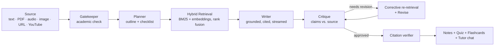

# 📚 Agentic Notes — a self-correcting multi-agent study engine

[](https://github.com/Kodishalathrilok/agentic-notes/actions/workflows/ci.yml)

**Live demo:** [huggingface.co/spaces/Thrilokkk/agentic-notes](https://huggingface.co/spaces/Thrilokkk/agentic-notes)

Feed it anything — pasted text, a PDF, a lecture recording, a photo of notes, an article URL, or a YouTube video — and a pipeline of cooperating AI agents turns it into **cited, verified study notes**, then quizzes you on them.

What makes it more than an "AI wrapper":

- **The pipeline checks its own work.** A critique agent re-reads the draft _against the source_, flags unsupported claims and missing topics, triggers corrective re-retrieval, and revises — keeping the best-scoring version.
- **Every claim is traceable.** Notes are grounded in retrieved passages with inline citations (`[3]`), and a deterministic verifier strips any citation the model invented.
- **Long documents actually work.** Large sources are covered by a full-document digest scan plus per-section map-reduce generation with parallel section writers — no "the model only read the first page" failure mode.
- **It's engineered, not vibe-coded:** 103 automated tests, CI that gates deploys on green tests, SSRF-guarded URL fetching, request size limits, per-user rate limiting, and an LLM-judge eval harness that scores faithfulness and coverage.

## How it works



Every stage streams to the UI in real time over SSE, so you watch the agents plan, write, critique, and revise live.

### Retrieval

The source is chunked and indexed two ways — **BM25** (lexical) and **semantic embeddings** (Gemini, with a TF-IDF fallback when no key is set) — and results are merged with rank fusion. Each agent works from the passages most relevant to _its_ task instead of a truncated dump of the document. A retrieval benchmark (`backend/eval/`) measures hit-rate against a labeled dataset.

### Reliability details that took real work

- **Structured outputs everywhere.** Quizzes and flashcards are generated as validated JSON and rendered to the UI format deterministically — a chatty model can't corrupt them. A verifier agent re-checks the quiz answer key against the notes and applies surgical corrections.
- **No tail-loss on long notes.** Read-only agents (critique, quiz, chat) sample evenly across the whole document; full-rewrite agents are guaranteed to see the entire text or the rewrite is refused — long notes can't be silently truncated mid-pipeline.
- **Graceful model routing.** NVIDIA NIM (Nemotron) and Gemini Flash with automatic failover, mechanical sub-tasks routed to cheaper models to preserve free-tier quota, and a local Ollama fallback for fully offline use. Gemini ids are pinned for speed and self-heal to Google's moving alias if a version is retired, so neither a dead id nor an overloaded brand-new one can stall the pipeline.

## Features

- **Inputs:** paste text · PDF · image (OCR) · audio (transcription) · article URL · YouTube transcript
- **Outputs:** cited notes · interactive quiz with verified answer key · spaced-repetition flashcards · PDF / Markdown / DOCX / CSV export
- **Study tools:** tutor chat grounded in your notes · select-and-edit any passage with an instruction · one-click rewrite (shorter / longer)
- **Controls:** study mode (exam, summary, deep-dive…), tone, length, format, model picker
- **Accounts:** Supabase auth (email + Google), cloud session history, shareable public note links — with a local-only mode when auth isn't configured

## Security & operations

- SSRF-protected URL fetching (private/internal addresses blocked, redirects re-validated per hop, download size capped)
- Request size limits on every endpoint; chunked uploads with hard caps (PDF 20 MB, audio 25 MB, image 10 MB)
- Per-user rate limiting with Supabase JWT verification on expensive endpoints
- Bounded worker pool + concurrency gate so heavy generations can't starve the server
- CI on every push: backend tests → frontend build → deploy to Hugging Face Spaces (deploy only on green)

## Tech stack

| Layer          | Tech                                                                       |
| -------------- | -------------------------------------------------------------------------- |
| Backend        | Python · FastAPI · SSE streaming                                           |
| Frontend       | React · Vite · Tailwind CSS                                                |
| Models         | NVIDIA NIM (Nemotron) · Gemini Flash · Ollama (local fallback)             |
| Retrieval      | BM25 (rank-bm25) + Gemini embeddings · rank fusion · TF-IDF fallback       |
| Auth & storage | Supabase (JWT verification server-side, RLS-scoped sessions)               |
| Docs           | pypdf · reportlab · python-docx · Gemini audio + vision                    |
| CI/CD          | GitHub Actions → Hugging Face Spaces (Docker)                              |

## Run it locally

Use a virtual environment. The pinned `fastapi`/`starlette` versions conflict
with what other common packages (gradio, streamlit) require, so a shared global
install will break one side or the other.

```bash
# 1. Backend
cd backend
cp .env.example .env          # add NVIDIA_API_KEY (build.nvidia.com) and/or GEMINI_API_KEY
python -m venv .venv
source .venv/bin/activate     # Windows: .\.venv\Scripts\Activate.ps1
pip install -r requirements.txt -r requirements-dev.txt
python -m uvicorn main:app --reload   # http://127.0.0.1:8000

# 2. Frontend (new terminal)
cd frontend
npm install
npm run dev                   # http://localhost:5173
```

Run the backend from the `backend/` directory, or launch it with an absolute
path — `main.py` and friends resolve `.env` relative to their own location, so
the keys load either way, but `main:app` still has to be importable.

`python main.py` also works and binds `0.0.0.0:8000` instead of loopback.

Works with either provider key on its own. Setting both gives you NVIDIA as
primary with Gemini as automatic failover:

| Variable                                                         | Purpose                                          |
| ---------------------------------------------------------------- | ------------------------------------------------ |
| `NVIDIA_API_KEY` / `NVIDIA_MODEL`                                | Primary writing model (exact catalog id required) |
| `GEMINI_API_KEY`                                                 | Failover, semantic embeddings, image OCR, audio transcription |
| `OLLAMA_URL` / `OLLAMA_MODEL`                                    | Local offline fallback                            |
| `VITE_SUPABASE_URL` / `VITE_SUPABASE_ANON_KEY`                   | Auth + cloud history (frontend `.env`)        |
| `MAX_TEXT_CHARS`, `WORKER_THREADS`, `MAX_CONCURRENT_GENERATIONS` | Server tuning                                 |

## Tests & evaluation

```bash
cd backend
pip install -r requirements-dev.txt
pytest        # 103 tests: pipeline, parsers, retrieval, security, truncation-safety
```

The eval harness (`backend/eval/`) runs the full pipeline on fixture documents and uses an LLM judge to score **faithfulness** (are claims supported by the source?), **coverage** (are key topics present?), and **quiz answer accuracy** — plus a retrieval hit-rate benchmark. Run with `python -m eval.run_eval`.

## Project structure

```
agentic-notes/
├── backend/
│   ├── main.py              # FastAPI app: SSE generation, extraction, exports, auth
│   ├── agent.py             # Multi-agent pipeline orchestrator
│   ├── models.py            # NVIDIA/Gemini/Ollama router, JSON-mode calls
│   ├── retriever.py         # Chunking + index orchestration
│   ├── retrieval/           # BM25, semantic, fusion, hybrid
│   ├── eval/                # LLM-judge eval harness + retrieval benchmark
│   ├── auth.py              # Supabase JWT verification + rate limiting
│   ├── pdf_export.py        # PDF / Markdown / DOCX / CSV rendering
│   └── tests/               # 103 tests
├── frontend/
│   └── src/                 # React app: streaming UI, quiz, flashcards, chat, auth
└── .github/workflows/       # CI: test → build → deploy
```

## Roadmap

- Retrieval index caching across requests
- Pairwise (A/B) critique comparison instead of absolute scoring
- Keep-alive job for the free-tier database

---

Built by [Kodishala Thrilok](https://github.com/Kodishalathrilok). If this repo is useful to you, a ⭐ is appreciated.
